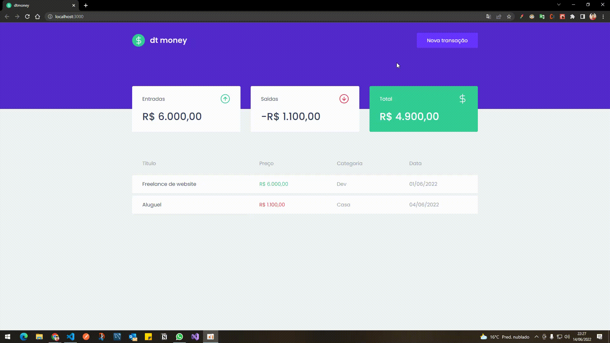
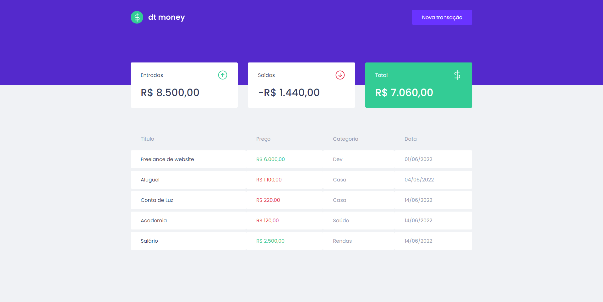

## Descrição
Aplicação para controle financeiro, onde é possível cadastrar receitas e despezas, visualizar a listagem e verificar o saldo total entre as saídas e entradas. Foi desenvolvida com os estudos e aprendizados da Trilha de ReactJS do Ignite da Rocketseat.

## 🚀 Tecnologias e ferramentas
- ReactJS
- TypeScript
- Mirage JS
- Axios
- Styled Components
- Context (React)
- Entre outras...

## 💻 Web

## ✅ Resultado

